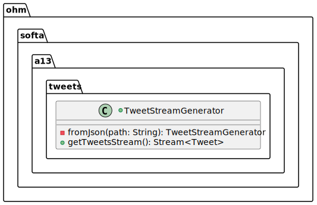

_This is an assignment to the class [Programmieren 3](https://hsro-inf-prg3.github.io) at the [University of Applied Sciences Rosenheim](http://www.fh-rosenheim.de)._

# Assignment 13: Map-Reduce and Collect

This assignment covers some more advanced concepts of the Java 8 `Stream`s API.
The concepts that are specifically topic of this assignment are:

* _Map-Reduce_
* _Collecting_
* _Grouping-By_

We'll use _Map-Reduce_ to implement the classical _word count_ example.
As sample data the repository contains about 3.000 tweets of Donald Trump we will analyze in this assignment.
As an alternative the assignment also contains a generator which uses the Twitter API fo fetch the tweets live.
To be able to use this generator you have to do some [additional configuration](#using-the-twitter-api).

After we analyzed which words Donald Trump uses most in his tweets we'll have a look which tweets are sent from which device.
A clever data scientist discovered that most of angrier tweets came from Android where the nicer ones were written with an iPhone ([first article](http://varianceexplained.org/r/trump-tweets/) and [follow up article](http://varianceexplained.org/r/trump-followup/)).
We will have a look if we can use Java's `Stream`s to group the tweets by the kind of client which was used to create them.

## Setup

1. Create a fork of this repository (button in the right upper corner)
1. Clone the project (get the link by clicking the green _Clone or download button_)
1. Import the project to your **IntelliJ**
1. **Read the whole assignment spec!**

_Remark: the given test suite is incomplete and **won't** succeed after the checkout!_

## Generators

To be able to analyze the tweets we need a generator which loads the given tweets (from a JSON file) and exposes them as a `Stream`.

The following UML shows the class structure of the generators and the factory which exposes them.



_Remark: the UML is not complete but just meant as implementation hint and for orientation._

_Hint: the dependency to GSON is already added and GSON exposes the following method:_

```java
Gson gson = new Gson();
Tweet[] tweets = gson.fromJson(reader, Tweet[].class);
```

Where `reader` is an instance of the interface `Reader`.
To access files from the `resources` folder implement something like in this snippet:

```java
getClass().getResourceAsStream("/path/to/trump_tweets.json");
```

_Side note: this is only possible if you are in a non `static` context, otherwise you have to write something like this: `MyClass.class.getResourceAsStream(...)`._

To implement the `OfflineTweetSteamGenerator` follow these steps:

1. Create the class `OfflineTweetSteamGenerator`.
1. Implement the interface `TweetStreamGenerator`.
1. Implement the method `getTweetStream` by using GSON and the helper method `Arrays.stream(T[] array)` to load the JSON file and create a new `Stream` from the deserialized tweet array.

Those who want to play around with some additional language features could use `try-with-resources` for the deserialization of the tweets.

And those who want a more functional way may be interested in this [Gist](https://gist.github.com/baez90/659d121064ff102a4e1e6a31bcf639c4).

## Map-Reduce

A classical algorithm used to process huge amounts of data is _Map-Reduce_.
As the name already indicates the algorithm consists of two steps:

* _Map_ - transform the data in parallel
* _Reduce_ - retrieve all interim results and aggregate them

## Collecting

That's pretty nice but printing results always to the command line with the terminator `forEach(...)` is not the really practicable.

To be able to process the data we need to `collect` them e.g. in a `List<>` or a `Set<>` or any other _Collection_.

## Using the Twitter API